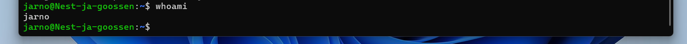

# [Onderwerp]
Opzetten VM verbinding door een SSH
## Key-terms
* __VM:__  
VM een Virtual Machine (VM) is een besturingssysteem (operatingsystem, OS) of applicatie-omgeving die geïnstalleerd is op software die specifieke hardware imiteert
* __SSH:__   
SSH staat voor Secure Shell, ook wel “shell” genoemd, en is een hulpmiddel om op een versleutelde manier op een andere computer of server in te loggen en op afstand op andere computers of servers commando’s uit te voeren. 

## Opdracht
### Gebruikte bronnen
1. https://www.hypernode.com/nl/blog/ssh-complete-uitleg/
2. https://linuxcommand.org/lc3_man_pages/ssh1.html
3. https://www.clickittech.com/aws/connect-ec2-instance-using-ssh/

### Ervaren problemen
[Kreeg geen toegang tot de pem key door wat te stoeien  met instellingen is het gelukt om verbinding te maken met de VM]

### Resultaat
 

Gebruik gemaakt van:
ssh -i $path "C:\Users\water\.ssh\jarno.pem" -p 52209 jarno@3.121.40.175
