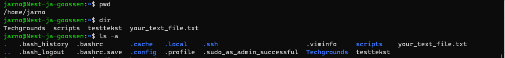
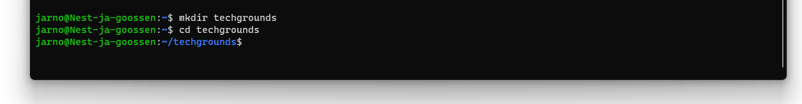

# Files & Directories

In Linux zijn files (bestanden) en directories (mappen) de basiscomponenten van het bestandssysteem. Ze worden gebruikt om gegevens op te slaan, te organiseren en te beheren. Hier is een uitleg van beide concepten:

Bestanden (Files): In Linux zijn bestanden de basisentiteiten die gegevens bevatten.

Bestandsnamen in Linux zijn hoofdlettergevoelig, wat betekent dat "bestand.txt" en "Bestand.txt" als twee verschillende bestanden worden beschouwd. Bestanden hebben attributen zoals leesbaarheid, schrijfbaarheid en uitvoerbaarheid, die bepalen welke bewerkingen op het bestand kunnen worden uitgevoerd.

Mappen (Directories): Mappen in Linux worden gebruikt om bestanden te organiseren en te structureren in een hiërarchische indeling. Ze kunnen andere mappen en bestanden bevatten. Mappen vormen een boomstructuur, waarbij de bovenste map de "root" is die wordt aangeduid met een schuine streep ("/"). Een pad zoals "/home/gebruiker/documenten" geeft bijvoorbeeld de locatie aan van de map "documenten" binnen de map "gebruiker" in de "home" -map.

## Key-terms
- Directories:  
Dit is hoe 'folders' of 'mappen' worden aangeduid in Ubuntu.
- Home:  
Dit is de folder waar je als gebruiker in begint als je Ubuntu opstart.

## Opdracht
### Gebruikte bronnen
[linuxcheat sheet](https://www.geeksforgeeks.org/linux-commands-cheat-sheet/)

[Linux commands handbook](https://bjpcjp.github.io/pdfs/devops/linux-commands-handbook.pdf)

### Ervaren problemen
[Geef een korte beschrijving van de problemen waar je tegenaan bent gelopen met je gevonden oplossing.]

### Resultaat
Ik gebruik 'pwd' om de huidige map te zien:  
 

Vervolgens gebruik ik 'ls' om te zien dat er geen andere directories zijn, maar 'ls -a' laat wel wat verborgen bestanden zien:  

Ik gebruik 'mkdir techgrounds' om een map aan te maken met de naam 'techgrounds':  

 

Ik gebruik 'cd' om naar de techgrounds map te gaan, en 'cat > tekstfile.txt' om een tekst file te maken. Vervolgens typ ik wat tekst in en eindig ik de input met 'ctrl+D'. Met 'cat tekstfile.txt' kan ik vervolgens zien wat ik heb geschreven:  

Met 'cd ..' kan ik een map omhoog, en ik kan ook precies aangeven naar welke map ik direct wil:  
