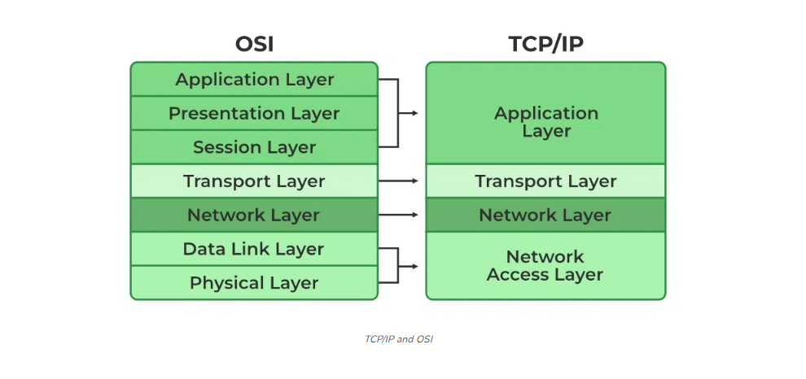

# [OSI model]
OSI model wordt gebruikt om computer of telecommunicatie problemen op te lossen.
een alternatief hiervoor is het TCP/IP model

## Key-terms
## OSI model
The Open Systems Interconnection Model. Developed by the International Organization for Standardization, it is is a theoretical model that explains how data flows from a program on one computer to another. It consists of seven layers, each of which has a different duty. Being that it is entirely conceptual, its primary use is to guide troubleshooting and to foster understanding of the mechanisms that underpin computer networking.

### De lagen van het OSI-model
Voor gebruikers lijkt de communicatie tussen twee computers triviaal, maar bij de gegevensoverdracht via een netwerk moeten talloze taken worden volbracht en deze dienen betrouwbaar, veilig en integer te zijn. Daarom is het nuttig gebleken de netwerkcommunicatie op te delen in lagen. Daarbij krijgt elke laag een exact gedefinieerd takenpakket. Een standaard dekt daarom meestal slechts een deel van het lagenmodel af. Dit model is hiërarchisch opgebouwd: elke laag heeft via een koppelvlak toegang tot de laag eronder en stelt de laag erboven diensten ter beschikking. Dit principe heeft twee belangrijke voordelen:

* Binnen een laag zijn de taken die moeten worden volbracht en de eisen waaraan moet worden voldaan duidelijk gedefinieerd. Zo kunnen onafhankelijk van elkaar standaards voor elke laag worden ontwikkeld.
* Doordat de afzonderlijke lagen duidelijk van elkaar zijn afgescheiden, hebben wijzigingen aan een standaard binnen de ene laag geen invloed op processen die in andere lagen lopen. Dit maakt het invoeren van nieuwe standaards gemakkelijker.

#### Layer 7: Application
Laag 7 – toepassingslaag (application layer): de toepassingslaag is het niveau van het OSI-model dat direct contact heeft met toepassingen als e-mailprogramma’s of webbrowsers. Hier worden gegevens uitgewisseld. De toepassingslaag brengt de verbinding met de lagere niveaus van het OSI-model tot stand en houdt functies voor toepassingen gereed. Aan de hand van het voorbeeld van de e-mailoverdracht kan deze laag als volgt worden verduidelijkt: een gebruiker tikt een bericht in het e-mailprogramma op zijn eindapparaat. Dit bericht wordt in de vorm van een datapakket in de toepassingslaag geladen. Daarbij wordt extra informatie aan de e-mailgegevens toegevoegd in de vorm van een ‘application header’. Dat wordt ook wel ‘inkapselen’ genoemd. Deze header bevat onder andere de informatie dat het pakket gegevens bevat die afkomstig zijn van een e-mailprogramma. Daarnaast wordt het protocol bepaald dat gebruikt wordt voor de overdracht van de e-mail op de toepassingslaag (in het geval van een e-mail meestal SMTP).

#### Layer 6: Presentation
een centrale taak bij de netwerkcommunicatie is ervoor te zorgen dat gegevens in standaardformaten worden overgedragen. In de presentatielaag worden lokale weergaven daarom vertaald naar gestandaardiseerde formaten. In het geval van de e-mailoverdracht wordt hier bepaald hoe het bericht moet worden weergegeven. Daarvoor wordt het datapakket aangevuld met een ‘presentation header’. Deze bevat informatie over hoe de e-mail gecodeerd is (in Nederland meestal ISO 8859-1 (Latin-1) of ISO 8859-15), in welk formaat eventuele bijlagen aanwezig zijn (bijv. JPEG of MPEG4) en hoe de gegevens gecomprimeerd of versleuteld zijn (bijv. SSL/TLS). Zo kan ervoor worden gezorgd dat het formaat van de e-mail ook door het doelsysteem wordt begrepen en het bericht daar correct wordt weergegeven.

#### Layer 5: Session
de centrale taak die in de sessielaag wordt volbracht, is het regelen van de verbinding tussen de twee eindsystemen. Daarom wordt deze laag ook wel communicatielaag genoemd. Hier zijn speciale regel- en controlemechanismen actief die het tot stand komen, onderhouden en beëindigen van de verbinding regelen. Voor deze communicatieregeling is extra informatie nodig die door een ‘session header’ aan de e-mailgegevens wordt toegevoegd. De meest gangbare applicatieprotocollen, zoals SMTP of FTP, houden zich zelf met de sessies bezig of zijn net als HTTP toestandsloos. Het TCP/IP-model dat concurreert met het OSI-model vat daarom OSI 5, 6 en 7 samen tot één application layer. Andere standaards die aansluiten op laag 5 zijn NetBIOS, Socks en RPC.

#### Layer 4: Transport
transportlaag (transport layer): de transportlaag fungeert als schakel tussen de toepassingsgeoriënteerde en de transportgeoriënteerde lagen. Op dit niveau van het OSI-model wordt de logische end-to-endverbinding, het overdrachtskanaal, tussen de communicerende systemen gerealiseerd. Ook daarvoor moet aan de e-mailgegevens bepaalde informatie worden toegevoegd. Het datapakket, dat al met de headers van de toepassingsgeoriënteerde lagen is uitgebreid, wordt in laag 4 aangevuld met een ‘transport header’. Daarbij worden gestandaardiseerde netwerkprotocollen als TCP of UDP gebruikt. Bovendien wordt in de transportlaag bepaald via welke poorten toepassingen op het doelsysteem kunnen worden aangestuurd. In laag 4 wordt een datapakket dus ook aan een bepaalde toepassing toegewezen.

#### Layer 3: Network
netwerklaag (network layer): met laag 3 bereikt de gegevensoverdracht het internet. In de netwerklaag worden de eindapparaten logisch geadresseerd. Hieraan wordt in laag 3 een eenduidig IP-adres toegewezen. Aan een datapakket, zoals de e-mailgegevens in het voorbeeld, wordt op het 3e niveau van het OSI-model een ‘network header’ toegevoegd, die informatie bevat over de routering en over de controle van de gegevensstroom. Ook hier maken de computersystemen gebruik van internetstandaards als IP, ICMP, X.25, RIP of OSPF. Bij het e-mailverkeer wordt meestal TCP over IP gebruikt.

#### Layer 2: Data Link
datalinklaag (data link layer): in de datalinklaag zorgen functies voor het herkennen van fouten, het verhelpen van fouten en de controle van de gegevensstroom ervoor dat overdrachtsfouten worden voorkomen. Daarvoor wordt het datapakket inclusief application, presentation, session, transport en network header omgeven door een frame van data link header en data link trail. Daarnaast vindt in de 2e laag de hardware-adressering plaats. Daarbij worden zogenaamde MAC-adressen gebruikt. De toegang tot het medium wordt geregeld door protocollen als Ethernet of PPP.

#### Layer 1: Physical
fysieke laag (physical layer): in de fysieke laag worden de bits van een datapakket omgezet in een fysiek signaal dat bij het overdrachtsmedium past. Alleen dit signaal kan via een medium als koperdraad, glasvezel of de lucht worden overgedragen. Het koppelvlak naar het overdrachtsmedium wordt bepaald door protocollen en normen als DSL, ISDN, Bluetooth, USB (fysieke laag) of Ethernet (fysieke laag).

##### #Encapsulation
Datapakketten doorlopen elke laag van het OSI-model, zowel op het systeem van de afzender als op het systeem van de ontvanger. Alle andere apparaten die het datapakket op weg naar de ontvanger passeert, passen alleen laag 1 t/m 3 toe. De e-mail uit het voorbeeld passeert als fysiek signaal eerst de router, voordat hij zijn weg door het internet vervolgt. Deze is in laag 3 van het OSI-model gevestigd en verwerkt daarom alleen informatie van de eerste drie lagen; de lagen 4 t/m 7 worden genegeerd. Om toegang te krijgen tot de benodigde informatie moet de router het ingekapselde datapakket eerst uitpakken. Daarbij worden de lagen van het OSI-model in omgekeerde volgorde doorlopen.

Eerst wordt het signaal gedecodeerd in de fysieke laag. Vervolgens worden MAC-adressen in laag 2 en IP-adressen en routingprotocollen in laag 3 opgehaald. Aan de hand van deze informatie kan de router beslissen hoe en waarheen het pakket moet worden doorgestuurd. Het datapakket kan dus weer worden ingekapseld en op basis van de ingewonnen informatie naar het volgende station op weg naar het doelsysteem worden gestuurd.

Meestal zijn meerdere routers betrokken bij een gegevensoverdracht. Op al deze routers vindt het beschreven proces (uitpakken en inkapselen) plaats tot het datapakket in de vorm van een fysiek signaal aankomt bij het eigenlijke doel (bijvoorbeeld een e-mailserver). Ook hier wordt het datapakket uitgepakt doordat de lagen van het OSI-model van laag 1 tot en met laag 7 worden doorlopen. Het bericht dat via de e-mailclient is verstuurd, is nu aangekomen bij de e-mailserver, waar het klaarstaat om door een andere e-mailclient te worden opgevraagd.

 

## wat is TCP/IP
TCP/IP signifies transmission control protocol/Internet Protocol. It was created by Defence Advanced Research Projects Agency (ARPA, later DARPA) in the late 1970s. It is a collection of communication protocol. It involves collection and methods for managing with packet transport, media access, session interaction, data transfer, email and terminal emulation.

#### Host to Network Layer
This is the lowest layer in the TCP/IP reference model. The layer functioning is usually different in various relations. The main function of this layer is to instruct the upper layer when the host is linked to the network so that they can establish sending the data packets.

#### Internet Layer
The functioning of the TCP/IP model’s internet layer is similar to the OSI model’s network layer’s functioning. This layer’s function is to enable the host to add packets into any relation and then create them transit separately to the target.

#### Transport Layer
The transport layer is placed above the internet layer of the TCP model. This layer functioning is equal to the functioning of the transport layer in the OSI model. In the transport layer, the byte flow is split into communication, and these communications are developed to the internet layer. It can support the functions like segmentation and disintegration of messages. This protocol is used in this layer are TCP and UDP.

#### TCP
TCP represents Transmission control protocol. It is a dependable connection-oriented protocol. It enables a byte flow broadcasted from one system to be delivered to another system without learning some bug. It can also manage flow control.

#### UDP
An uncertain, connectionless protocol used for applications that do not need the TCPs series or flow control. It can be used in sending speech or video.

#### Application Layer
This is the highest layer of the TCP/IP layer. The application program’s layer view is a user-oriented layer that helps services provide the network’s end-user precisely. A message or information to be transmitted across the network introduce the TCP/IP model and then carry down into the communication line up to host to the network layer of destination and then upwards up to the receiver end framework application layer.

This layer uses various protocols to transfer the data between applications.

 

## Some standard protocols used 

#### FTP (File Transfer Protocol)
It is used for file transmission between internetwork nodes.

#### SMTP (Simple Mail Transfer Protocol)
It can be used for exchanging email.

#### TELNET
TELNET represents Terminal Network. It allows the client to create host-based software by initiating one of the host terminals. It also supports connectivity between the diverse operating framework.

#### DNS (Domain Name Systems)
The DNS can change the domain name into IP addresses. The TCP/IP protocol needs the IP address that recognizes linking a host to the computer network.

#### HTTP (Hypertext Transfer Protocol)
HTTP is an internet protocol created for a particular software, the World Wide Web (WWW).

 

#### Verschillen OSI TCP

 
 

## Opdracht
### Gebruikte bronnen
[Uitleg OSI](https://www.strato.nl/server/wat-is-het-osi-model/)  
[Extra uitleg OSI](https://www.javatpoint.com/osi-model)  
[Uitleg TCP/IP model.](https://www.tutorialspoint.com/the-tcp-ip-reference-model)  
[Extra uitleg TCP/IP model](https://www.javatpoint.com/computer-network-tcp-ip-model)  
[Verschil tussen OSI and TCP/IP](https://www.tutorialspoint.com/difference-between-osi-and-tcp-ip-reference-model)  

