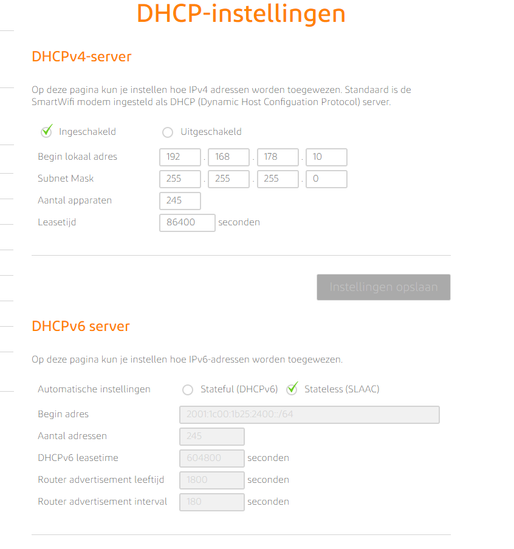

# [Network Devices]

Networking devices are hardware components that play various roles in computer networks. They are essential for the transmission, routing, and management of data in both local area networks (LANs) and wide area networks (WANs)

## Key-terms
Router: Routers are crucial devices in network infrastructure. They connect different networks and determine the best path for data to travel between them. They operate at the network layer (Layer 3) of the OSI model.

Switch: Switches are used to connect devices within the same network, such as computers, printers, and servers. They operate at the data link layer (Layer 2) and use MAC addresses to forward data to the correct device.

Hub: Hubs are older devices that operate at the physical layer (Layer 1). They simply broadcast data to all devices on a network segment without any intelligence to filter or route data.

Access Point (AP): Access points are used to connect wireless devices to a wired network. They function as a bridge between wired and wireless networks and enable Wi-Fi connectivity.

Firewall: Firewalls are network security devices that filter and control network traffic based on a set of security rules. They help protect a network from unauthorized access and threats.

Modem: A modem (modulator-demodulator) is used to convert digital data from a computer into analog signals for transmission over analog communication lines (e.g., telephone lines) and vice versa. It's essential for connecting to the internet via DSL, cable, or dial-up connections.

* Load Balancer: Load balancers distribute network traffic across multiple servers or network resources to optimize performance and ensure high availability. They are commonly used in data centers and web applications.

* Proxy Server: A proxy server acts as an intermediary between a client and a server, forwarding requests and responses. They are often used for security, caching, and content filtering.

* Network Attached Storage (NAS): NAS devices are dedicated storage devices that connect to the network, allowing multiple users to access and store data. They are commonly used for file sharing and data backup.

* Gateway: A gateway is a device that connects two different networks, often with different protocols or communication technologies, to enable data to flow between them. It can perform protocol conversion and data translation.

* Network Interface Card (NIC): NICs are hardware components in computers and other devices that enable them to connect to a network. They provide the necessary hardware interface for network communication.

* Cable/DSL Modem: These devices connect your home or business network to the internet through broadband connections such as cable or DSL.

* VPN (Virtual Private Network) Concentrator: A VPN concentrator is used to establish and manage secure remote access connections. It is often used to connect remote users or branch offices to a central network securely.

* Kabel/DSL Modem: Deze apparaten verbinden uw thuis- of bedrijfsnetwerk met internet via breedbandverbindingen zoals kabel of DSL.

* VPN (Virtual Private Network) Concentrator: Een VPN-concentrator wordt gebruikt om veilige externe toegangsverbindingen tot stand te brengen en te beheren. Het wordt vaak gebruikt om externe gebruikers of filialen veilig aan te sluiten op een centraal netwerk.

## Opdracht
De meeste routers hebben een overzicht van alle verbonden apparaten, vind deze lijst. Welke andere informatie heeft de router over aangesloten apparatuur?

 

Waar staat je DHCP server op jouw netwerk? Wat zijn de configuraties hiervan?

 

### Gebruikte bronnen
[OpenAI](https://openai.com/gpt-4)

[Network Devices](https://www.geeksforgeeks.org/network-devices-hub-repeater-bridge-switch-router-gateways/)

### Ervaren problemen
[Geef een korte beschrijving van de problemen waar je tegenaan bent gelopen met je gevonden oplossing.]

### Resultaat
[Omschrijf hoe je weet dat je opdracht gelukt is (gebruik screenshots waar nodig).]
