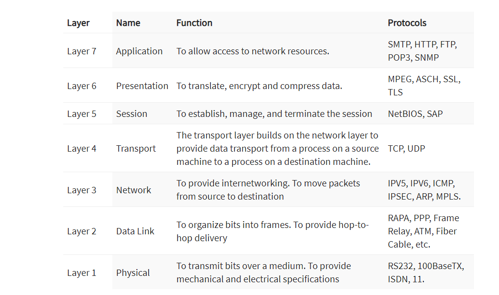
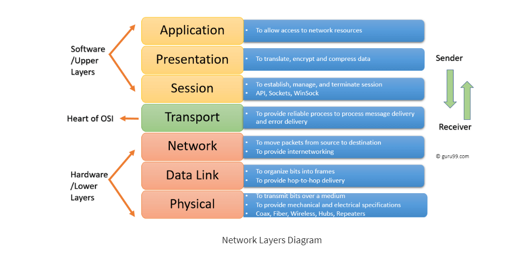

# [protocols]
A network protocol is an agreement about how to communicate. There are protocols on every layer of the OSI stack.

## Key-terms
#### Wireshark
Wireshark is a free and open-source packet analyzer. It is used for network troubleshooting, analysis, software and communications protocol development, and education. Originally named Ethereal, the project was renamed Wireshark in May 2006 due to trademark issue

## Opdracht
Identify several other protocols and their associated OSI layer. Name at least one for each layer.

Physical Layer (Layer 1):

* Protocol: Ethernet
Description: Ethernet is a widely used protocol for wired local area networks (LANs). It defines the physical medium (e.g., cables, connectors) and the electrical signals used for data transmission.

Data Link Layer (Layer 2):

* Protocol: IEEE 802.11 (Wi-Fi)
Description: IEEE 802.11, commonly known as Wi-Fi, operates at the data link layer. It defines how data is formatted for transmission over wireless networks and manages access to the wireless medium.
Network Layer (Layer 3):

* Protocol: Internet Protocol (IP)
Description: IP is responsible for routing packets of data so that they can travel across networks and arrive at their intended destinations. IPv4 and IPv6 are the most well-known versions of IP.

Transport Layer (Layer 4):

* Protocol: Transmission Control Protocol (TCP)
Description: TCP is a connection-oriented protocol that provides reliable, error-checked, and ordered delivery of data between two devices on a network.

Session Layer (Layer 5):

* Protocol: NetBIOS (Network Basic Input/Output System)
Description: NetBIOS is a session layer protocol used in older Windows-based networks for establishing and terminating sessions between devices.

Presentation Layer (Layer 6):

* Protocol: Secure Sockets Layer (SSL) / Transport Layer Security (TLS)
Description: SSL and TLS are encryption protocols used to secure data during transmission. They operate at the presentation layer, ensuring data privacy and integrity.

Application Layer (Layer 7):

* Protocol: Hypertext Transfer Protocol (HTTP)
Description: HTTP is the foundation of data communication on the World Wide Web. It enables the transfer of web pages and resources between web servers and web clients (browsers).

Overzicht protocols

 

 

### Gebruikte bronnen
[Overzicht layers](https://www.guru99.com/layers-of-osi-model.html)

### Ervaren problemen
[Geef een korte beschrijving van de problemen waar je tegenaan bent gelopen met je gevonden oplossing.]

### Resultaat
[Omschrijf hoe je weet dat je opdracht gelukt is (gebruik screenshots waar nodig).]
