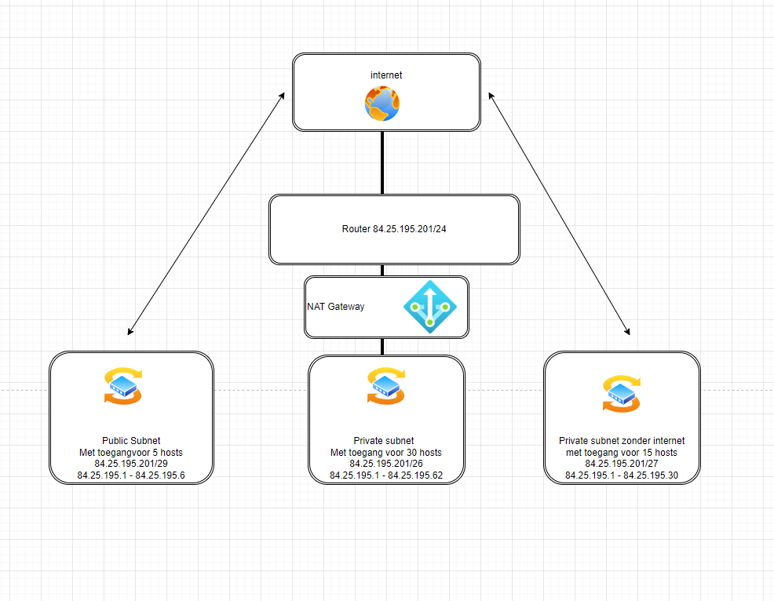

# [Onderwerp]
[Geef een korte beschrijving van het onderwerp]

## Key-terms
[Schrijf hier een lijst met belangrijke termen met eventueel een korte uitleg.]

## Opdracht Maak een netwerkarchitectuur die voldoet aan de volgende eisen:

* 1 subnet dat internet toegang heeft via een router met NAT-functionaliteit. Dit subnet moet minimaal 30 hosts kunnen plaatsen (de 30 hosts is exclusief de router).
Dit is het meest efficient door een /26 CIDR te gebruiken, deze geeft 62 hosts

Address:   84.25.195.201         
Netmask:   255.255.255.192 = 26  
Wildcard:  0.0.0.63             
=>
Network:   84.25.195.192/26      
Broadcast: 84.25.195.255         
HotMin:   84.25.195.193       
HostMax:   84.25.195.254         
Hosts/Net: 62 

* 1 subnet met een network gateway naar het internet. Dit subnet moet minimaal 5 hosts kunnen plaatsen (de 5 hosts is exclusief de internet gateway).
Dit is het meest efficient door een /29 CIDR te gebruiken, deze geeft 6 hosts

Address:   84.25.195.201         
Netmask:   255.255.255.248 = 29  
Wildcard:  0.0.0.7               
=>
Network:   84.25.195.200/29      
Broadcast: 84.25.195.207         
HostMin:   84.25.195.201         
HostMax:   84.25.195.206        
Hosts/Net: 6   

* 1 subnet met een network gateway naar het internet. Dit subnet moet minimaal 5 hosts kunnen plaatsen (de 5 hosts is exclusief de internet gateway)

### Gebruikte bronnen
[you suck at subnetting](https://www.youtube.com/watch?v=5WfiTHiU4x8&list=PLIhvC56v63IKrRHh3gvZZBAGvsvOhwrRF)
[Subnetting is simple](https://www.youtube.com/watch?v=ecCuyq-Wprc)
[ip calculator](https://jodies.de/ipcalc?host=84.25.195.201&mask1=27&mask2=)

### Ervaren problemen
Moest veel internetbronnenraadplegen om het kwartje een beetje te laten vallen

### Resultaat
 
