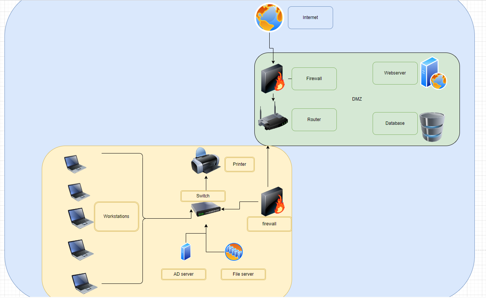

# [Network case study]
[Geef een korte beschrijving van het onderwerp]

## Key-terms
- <strong>DMZ<strong> Een demilitarized zone (DMZ) is een computernetwerk dat dienstdoet als bufferzone tussen twee netwerken. De DMZ heeft een eigen IP-adresruimte en scheidt netwerken door strenge toegangsvoorschriften. Servers binnen een demilitarized zone zijn fysiek weliswaar in hetzelfde bedrijf aanwezig, maar zijn niet direct verbonden met de apparaten die verbinding hebben met het lokale netwerk. De hoogste bescherming biedt een situatie waarbij de DMZ-server tussen het LAN en het internet in door twee aparte firewalls wordt afgeschermd van de aangrenzende netwerken. De netwerkarchitectuur waarbij alle netwerken aangesloten zijn op een enkele firewall met drie aparte aansluitingen is echter beter betaalbaar. Dit wordt een protected DMZ genoemd.

## Opdracht
### Gebruikte bronnen
[wat is DMZ](https://www.youtube.com/watch?v=dqlzQXo1wqo)

### Ervaren problemen
Geen ervaring met architexctuur dus ik ben maar begonnen met wat mij prakrtisch leek

### Resultaat
 
