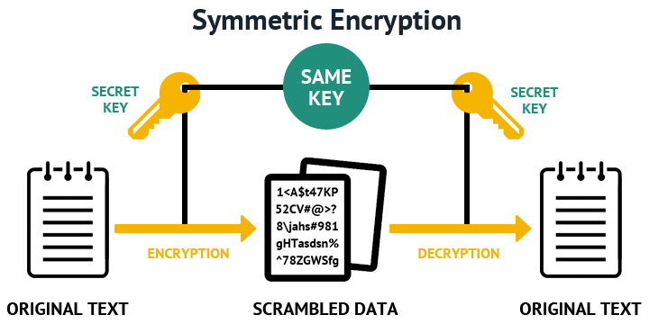
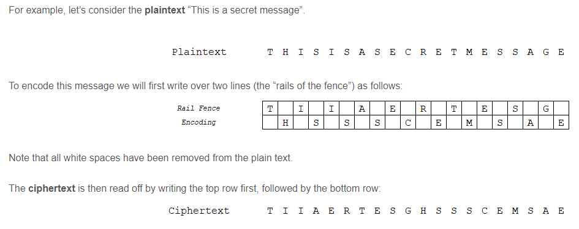

# [Symmetric encryption]
Bij symmetrische encryptie wordt dezelfde sleutel gebruikt voor het coderen én decoderen van informatie. Dit betekent dat die sleutel zowel in de handen van de verzender, als van de ontvanger moet zijn. Het grote voordeel van symmetrische cryptografie is dat het erg snel is. Aan beide uiteinden van het dataverkeer vindt namelijk dezelfde soort versleuteling plaats.

## Key-terms
Encryptie:
 
 Encryptie, of versleuteling, is een manier om gegevens te coderen. Dit zorgt ervoor dat niet iedereen deze gegevens zomaar te zien krijgt. Dit coderen gaat op basis van een algoritme, zodat men de gegevens later weer kan ontsleutelen en lezen. Dit proces van ontsleuteling heet decryptie.
 
  verschillende encryptiemethodes:

- SSL/TLS
- RSA
- PGP
- SHA
- SSH

Ook VPN-verbindingen maken gebruik van encryptie. Het gaat hier vaak om extra complexe algoritmes. Voorbeelden van VPN-encryptie die we in dit artikel aanhalen zijn:

- Blowfish
- IPSec
- MPPE
- Camellia
- 3DES
- AES-128
- AES-256
- ChaCha20

 

## Opdracht

1. Find one more historic cipher besides the Caesar cipher.

- Mono-Alphabetic Substitution Cipher:
A mono-alphabetic cipher (aka simple substitution cipher) is a substitution cipher where each letter of the plain text is replaced with another letter of the alphabet. It uses a fixed key which consist of the 26 letters of a “shuffled alphabet”.

Plain text alphabet:
A	B	C	D	E	F	G	H	I	J	K	L	M	N	O	P	Q	R	S	T	U	V	W	X	Y	Z

Cipher text alphabet (key):
	M	U	A	L	V	O	Z	K	R	N	J	X	Q	D	F	S	H	P	E	B	C	T	I	W	Y	G

- The rail Fence cipher

he rail fence cipher (sometimes called zigzag cipher) is a transposition cipher that jumbles up the order of the letters of a message using a basic algorithm.

The rail fence cipher works by writing your message on alternate lines across the page, and then reading off each line in turn.

 

2. Find two digital ciphers that are being used today.

3. Send a symmetrically encrypted message to one of your peers via the public Slack channel. They should be able to decrypt the message using a key you share with them. Try to think of a way to share this encryption key without revealing it to everyone. You are not allowed to use any private messages or other communication channels besides the public Slack channel. Analyse the shortcomings of symmetric encryption for sending messages.

### Gebruikte bronnen
[rail fence](https://www.101computing.net/the-rail-fence-cipher/)

(#:~:text=The%20first%20recorded%20instance%20of,to%20be%20sent%20and%20received.)
(https://www.encryptionconsulting.com/education-center/symmetric-vs-asymmetric-encryption/)

### Ervaren problemen
Geen issues wel leuk om oude cyphers te zien

### Resultaat
[Omschrijf hoe je weet dat je opdracht gelukt is (gebruik screenshots waar nodig).]
