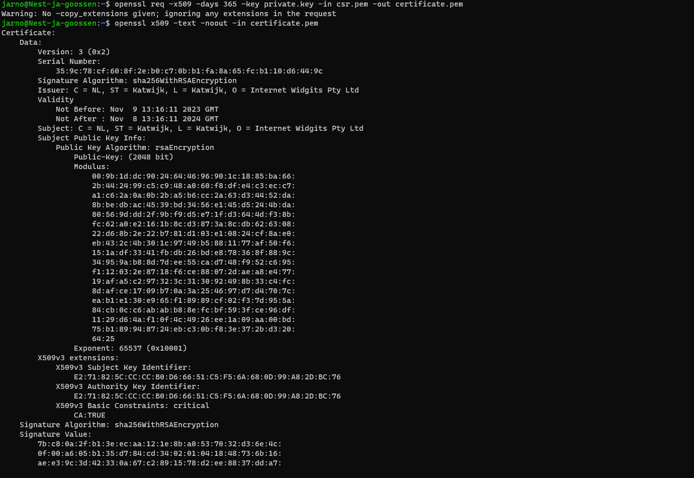
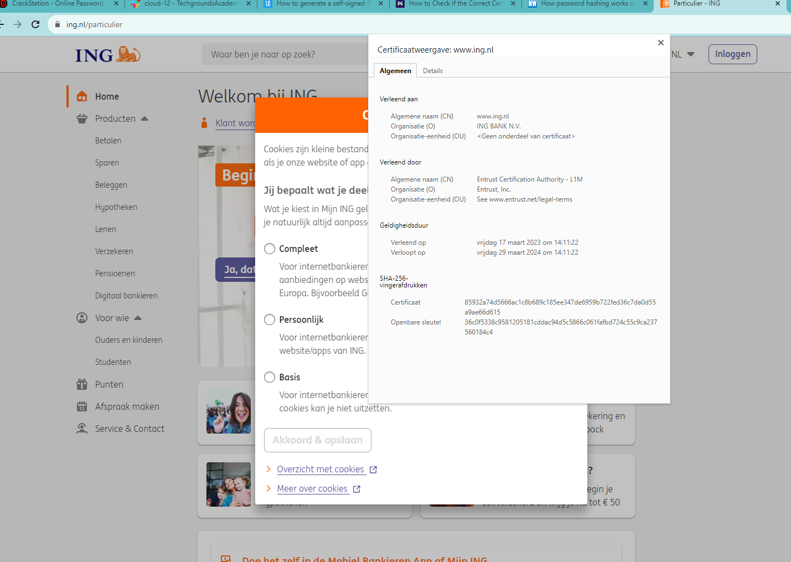
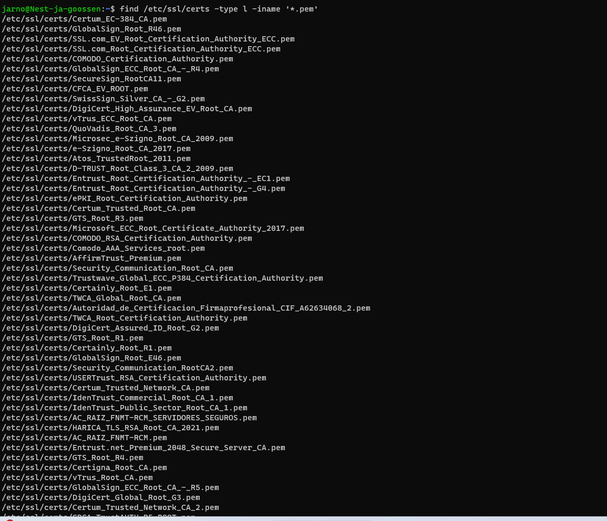

# [Onderwerp]
Public Key Infrastructure (PKI) is a set of roles, policies, hardware, software and procedures needed to create, manage, distribute, use, store and revoke digital certificates and manage public-key encryption.

It consists of three entities that assure you can communicate securely over an insecure network like the public internet.

## Key-terms
X.509 is the standard which defines the process in which a PKI should function. There are many ways of implementing a PKI, not all of them comply with the X.509 standard.

## Opdracht
- Create a self-signed certificate on your VM.

 

Analyze some certification paths of known websites (ex. techgrounds.nl / google.com / ing.nl).

 

Find the list of trusted certificate roots on your pc/laptop (bonus points if you also find it in your VM).

 

### Gebruikte bronnen
[Plaats hier de bronnen die je hebt gebruikt.]

### Ervaren problemen
[Geef een korte beschrijving van de problemen waar je tegenaan bent gelopen met je gevonden oplossing.]

### Resultaat
[Omschrijf hoe je weet dat je opdracht gelukt is (gebruik screenshots waar nodig).]
