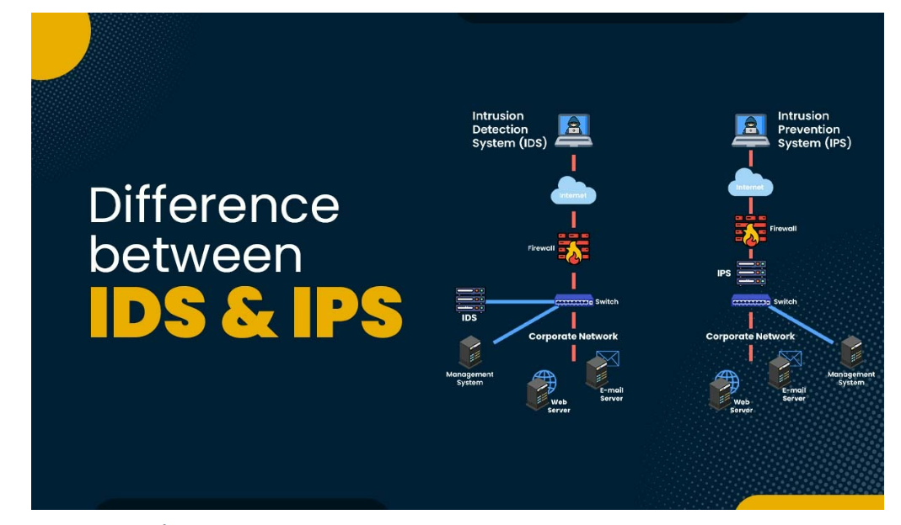
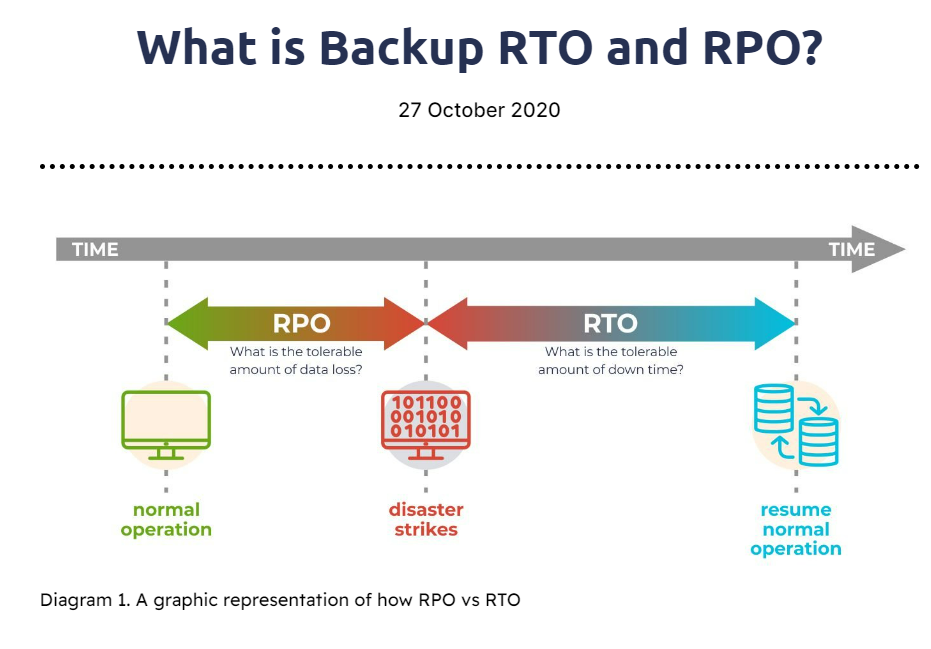

# [Onderwerp]
[Geef een korte beschrijving van het onderwerp]

## Key-terms
- IDS 

Intrusion Detection Systems (IDS) are crucial for managing network security. They search for suspicious behavior or signs of a potential compromise by analyzing the packets that move across your network. There are various types of IDS, such as host-based, network-based, signature-based, and anomaly-based, each with different use cases [1]. Signature-based IDS identifies known threats by comparing network packets to a database of indicators of compromise (IOCs), while anomaly-based IDS uses machine learning to detect abnormal behavior. Anomaly-based IDS can detect zero-day exploits but also has a higher likelihood of false positive

- IPS

IPS stands for Intrusion Prevention System. It is a network security tool that monitors and prevents malicious activity on a network. Unlike an Intrusion Detection System (IDS), an IPS takes action to prevent malicious activity. It can be a hardware device or software and is often included in next-generation firewalls or unified threat management solutions. IPS uses signature-based, anomaly-based, and policy-based methods to identify threats and can take automated actions when detecting malicious activity, such as alerting administrators, dropping packets, or blocking traffic.

 

- Hack response strategies
- The concept of systems hardening.
- Different types of disaster recovery options.

- RTO

RTO is de tijd die nodig is om alle applicaties en systemen te herstellen na een storing. RTO wordt meestal gemeten vanaf het moment dat de storing optreedt, en niet vanaf het moment dat het IT-team in actie komt. Immers, de start van de storing is het moment dat gebruikers en klanten zijn getroffen. De tijd tussen de start van de storing en het moment dat het IT-team in actie komt wordt dus meegerekend in de RTO.

De RTO moet worden vastgesteld om vooraf duidelijk te. Zijn wat. De downtime zal zijn in geval van calamiteiten. De doelstelling om de RTO zo laag mogelijk te houden heeft als doel om de storing in de dienstverlening tot een minimum te beperken.

3 aandachtspunten om rekening mee te houden bij het vaststellen van de RTO:

1. Hoeveel downtime kan jouw bedrijf zich veroorloven?
2. Wat is je budget voor het herstellen van applicaties, systemen en bestanden?
3. Wat heb je nodig voor een volledige systeem- en gegevensherstel?

- RPO

De RPO specificeert hoeveel gegevensverlies een organisatie of bedrijf zich kan veroorloven voordat de productiviteit, omzet en reputatie wordt aantast. Hoewel het een beetje tegenstrijdig klinkt, wordt dit uitgedrukt in tijd.

Het meten van de RPO kan erg lastig zijn, omdat het afhangt van meerdere variabelen, waaronder het type gegevens dat moet worden beschermd, de waarde van die gegevens en de status van de configuratie.

Financiële afdelingen kunnen bijvoorbeeld back-up servers gebruiken waarop realtime applicaties draaien om downtime helemaal te voorkomen. Andere afdelingen kunnen het zich misschien beter permitteren om een bepaald verlies van gegevens te accepteren.

Het bepalen van een acceptabel risiconiveau staat bekend als het vaststellen van de RPO-drempel. Dit is een belangrijk onderdeel van het bedrijfscontinuïteitsplan om ervoor te zorgen dat belangrijke data altijd beschikbaar blijft, ook in het geval van een ramp.

3 aandachtspunten om rekening mee te houden bij het vaststellen van de RPO:

1. Hoe vaak worden bedrijfskritieke gegevens gewijzigd?
2. Hoe vaak wordt er een back-up gemaakt?
3. Hoeveel opslagruimte is er beschikbaar voor de back-ups?

 

## Opdracht

A Company makes daily backups of their database. The database is automatically recovered when a failure happens using the most recent available backup. The recovery happens on a different physical machine than the original database, and the entire process takes about 15 minutes. What is the RPO of the database?

15 min

An automatic failover to a backup web server has been configured for a website. Because the backup has to be powered on first and has to pull the newest version of the website from GitHub, the process takes about 8 minutes. What is the RTO of the website?

8 min

### Gebruikte bronnen
[IDS](https://www.n-able.com/blog/intrusion-detection-system)

[IPS](https://www.vmware.com/topics/glossary/content/intrusion-prevention-system.html)

[RPO&RTO](https://www.datto.com/nl/blog/het-belang-van-rpo-en-rto)

### Ervaren problemen
[Geef een korte beschrijving van de problemen waar je tegenaan bent gelopen met je gevonden oplossing.]

### Resultaat
[Omschrijf hoe je weet dat je opdracht gelukt is (gebruik screenshots waar nodig).]
