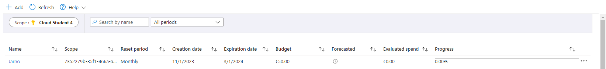

# **Cost Management**

Voordeel van de cloud is dat je alleen betaalt voor wat je gebruikt. Het gaat hier om OPEX in plaats van CAPEX uitgaven. De “Cost Management + Billing” tool geeft inzicht in je uitgaven in Azure en stelt je in staat je subscriptions te beheren.

Wanneer je een `Free Account` of een `Student Account` aanmaakt krijg je een bedrag van Microsoft cadeau om in Azure mee te experimenteren. Houd er rekening mee dat na 30 dagen je subscription automatisch stop wordt gezet, waardoor al je nog draaiende diensten uitgezet worden.

Als je een `Pay-as-you-go` subscription heb aangemaakt zijn er een aantal diensten die tot een bepaald gebruik altijd gratis zijn. Begrijp wel dat deze diensten soms geïntegreerd zijn met andere diensten waar je wel voor moet betalen. 

Azure geeft de volgende principes om succesvol je kosten te reduceren:
1. *Plan (Planning)*
2. *Zichtbaarheid (Visibility)*
3. *Verantwoording (Accountability)*
4. *Optimalisatie (Optimization)*
5. *Iteratie (Iteration)*

De Total Cost of Ownership (TCO) wordt gebruikt om te berekenen hoeveel een infrastructuur kost als het op de traditionele manier gehost wordt. Met de TCO-calculator kan je de kosten van een traditionele infrastructuur vergelijken met de kosten voor dezelfde infrastructuur op Azure.

## **Key-terms**

- **OPEX**

    Operating Expenditures (OPEX). Day-to-day kosten om het bedrijf operationeel te houden. 

- **CAPEX**
    
    Capital expenditures (CAPEX). Grote investeringen voor de lange termijn. 

- **De [Azure principes voor kostenmanagement](https://docs.microsoft.com/nl-nl/azure/architecture/framework/cost/principles)**
    
    - Binnen de kostenbeperkingen blijven
    - Streven naar schaalbare kosten
    - Betalen voor verbruik
    - Juiste resources, juiste grootte
    - Bewaken en optimaliseren

- **De voorwaarden van de [Free subscription](https://azure.microsoft.com/nl-nl/free/)**
    
    - 12 maanden toegang tot VM's met Windows en Linux, SQL database, Blob storage.

- **De [TCO-calculator](https://azure.microsoft.com/nl-nl/pricing/tco/calculator/)**
    
    - Total Cost of Ownership

## **Opdracht**

- Maak een alert aan waarmee je eigen Cloud Pass kan monitoren.
- Begrijp de opties die Azure aanbiedt om je uitgaven in te zien.

### **Gebruikte bronnen**

*<https://www.investopedia.com/ask/answers/112814/whats-difference-between-capital-expenditures-capex-and-operational-expenditures-opex.asp>*

*<https://docs.microsoft.com/nl-nl/azure/architecture/framework/cost/principles>*

### **Ervaren problemen**

Geen

### **Resultaat**

Alert aangemaakt volgens opdracht:
