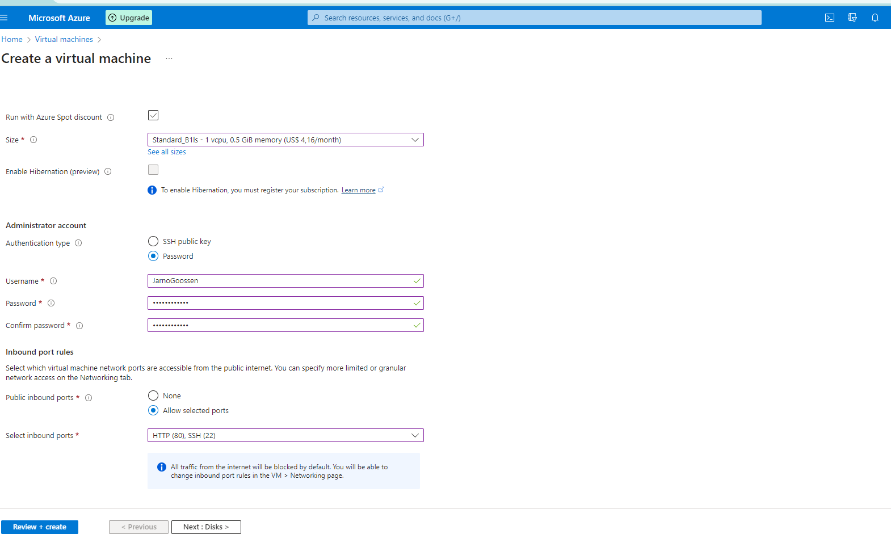

# [VM]
De Service waarmee je VMs kan maken in Azure heet (zeer toepasselijk) Azure Virtual Machines. Je kan deze VMs gebruiken voor alles waar je een fysieke server voor zou gebruiken. Omdat ze in een datacenter van Microsoft staan, kan je er alleen verbinding mee maken via het internet. Verbinding met een remote Linux-machine maak je met het Secure Shell (ssh) protocol. Voor een verbinding met Windows machines gebruik je het Remote Desktop Protocol (RDP).

Om een VM aan te maken moet je een image selecteren. Een image is een soort blauwdruk voor je machine. Het bevat onder andere een template voor het OS.

## Key-terms
[Schrijf hier een lijst met belangrijke termen met eventueel een korte uitleg.]

## Opdracht

Log in bij je Azure Console.
Maak een VM met de volgende vereisten:
Ubuntu Server 20.04 LTS - Gen1
Size: Standard_B1ls
Allowed inbound ports:
HTTP (80)
SSH (22)

 

 

OS Disk type: Standard SSD
Networking: defaults
Boot diagnostics zijn niet nodig
Custom data:
#!/bin/bash
sudo su
apt update
apt install apache2 -y
ufw allow 'Apache'
systemctl enable apache2
systemctl restart apache2

 

Controleer of je server werkt.

 

Let op! Vergeet na de opdracht niet alles weer weg te gooien. Je kan elk onderdeel individueel verwijderen, of je kan in 1 keer de resource group verwijderen.
### Gebruikte bronnen
[Plaats hier de bronnen die je hebt gebruikt.]

### Ervaren problemen
[Geef een korte beschrijving van de problemen waar je tegenaan bent gelopen met je gevonden oplossing.]

### Resultaat

Hij doet het 

 
