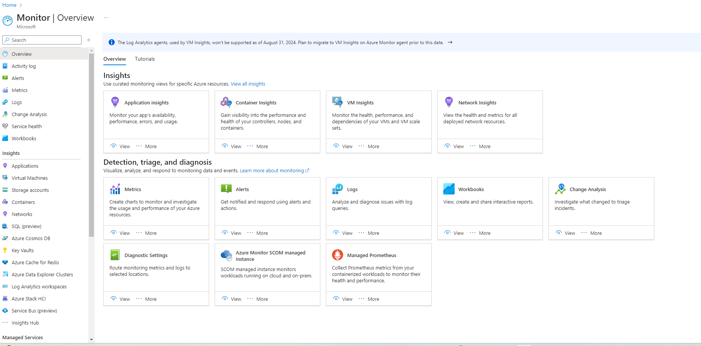
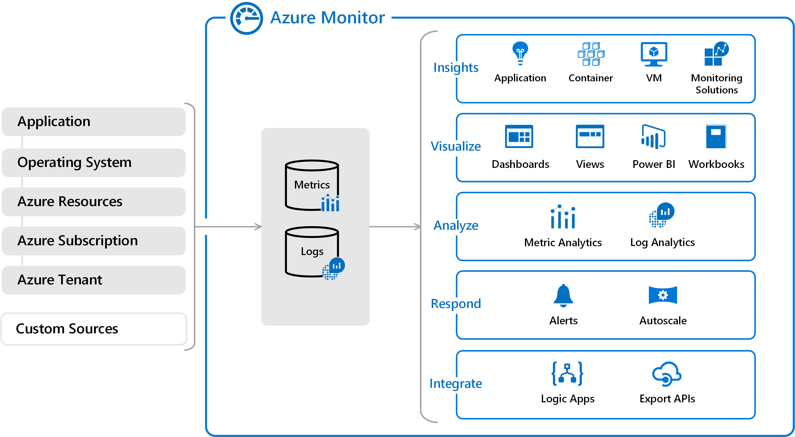

# [Onderwerp]
[Geef een korte beschrijving van het onderwerp]

## Key-terms
Microsoft Entra ID
Azure Monitor
CosmosDB
Azure Functions
Event Grid, Queue Storage & Service Bus

## Opdracht

Doe praktische ervaring op met:

- Microsoft Entra ID

Microsoft Entra ID is een cloudgebaseerde oplossing voor identiteits- en toegangsbeheer. Het is een directory- en identiteitsbeheerservice die in de cloud werkt en authenticatie- en autorisatiediensten biedt aan verschillende Microsoft-services zoals Microsoft 365, Dynamics 365 en Microsoft Azure.

 

 

 

- Azure Monitor

Met Azure Monitor worden de beschikbaarheid en prestaties van toepassingen en services gemaximaliseerd, door een uitgebreide oplossing te bieden voor het verzamelen en analyseren van, en werken met telemetriegegevens vanuit cloud- en on-premises omgeving. Het helpt begrijpen hoe toepassingen presteren en stelt proactief problemen vast die betrekking hebben op de toepassingen en de resources waarvan ze afhankelijk zijn.

 

 

CosmosDB
Azure Functions
Event Grid, Queue Storage & Service Bus

### Gebruikte bronnen
[Plaats hier de bronnen die je hebt gebruikt.]

### Ervaren problemen
[Geef een korte beschrijving van de problemen waar je tegenaan bent gelopen met je gevonden oplossing.]

### Resultaat
[Omschrijf hoe je weet dat je opdracht gelukt is (gebruik screenshots waar nodig).]
